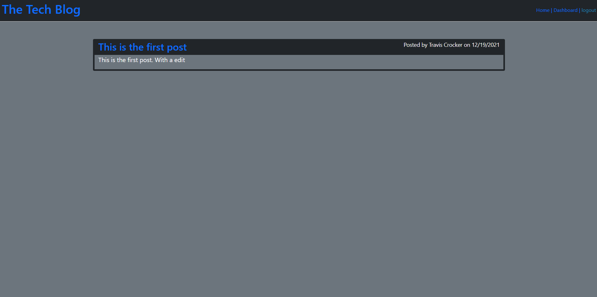

# Employee Management System
# License
 
# Deployed Link [TechBlog](https://mysterious-plains-66594.herokuapp.com/)

# Table of Contents
[Description](#description) 
[Installation](#installation) 
[Usage](#usage) 
[License](#license) 
[Contributing](#contributing) 
[Tests](#tests) 
[Questions](#questions) 
# Description
This app is a blog application. You can add new posts, comment on posts, and edit your past posts.
# Installation
Download the code from github, then open a terminal where the package.json is located. Run npm install to install the required packages.
Then run mysql -u root -p , enter password, run source schema.sql to create the database. Then quit mysql and run npm run seed to seed the database with relevant information.
# Usage
Vist the deployed link to use the app! [TechBlog](https://mysterious-plains-66594.herokuapp.com/)
# Contributing
Travis Crocker
# Tests
### How to test the application.
No Tests
# Questions
### For questions contact me using the information below.
Travis.Crocker.Dev@gmail.com [github](https://Github.com/tmcrocker89)
